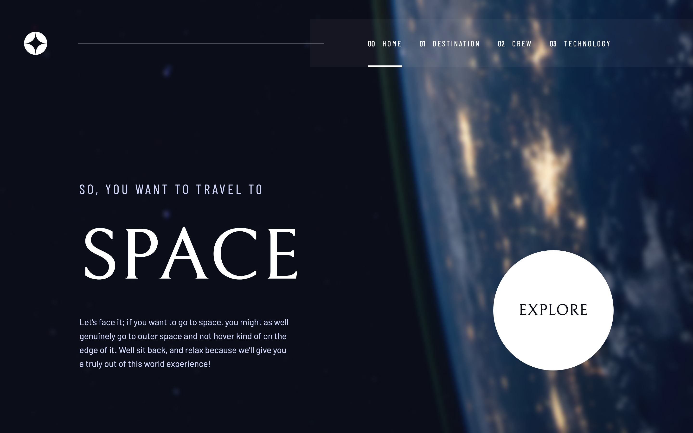
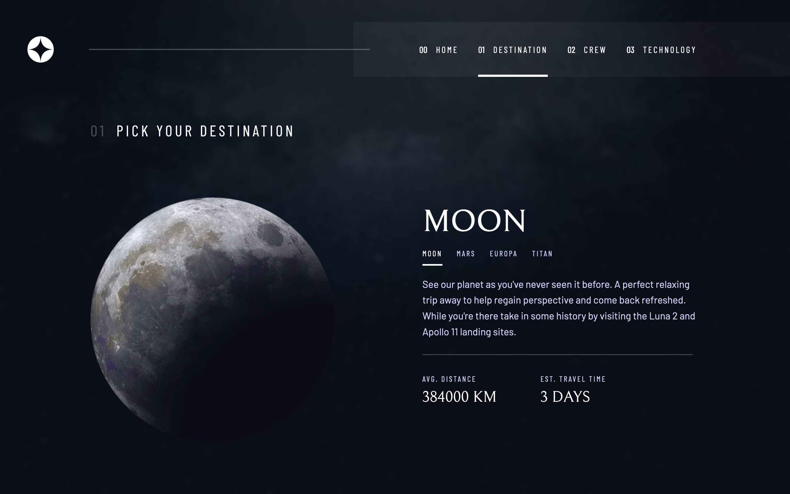
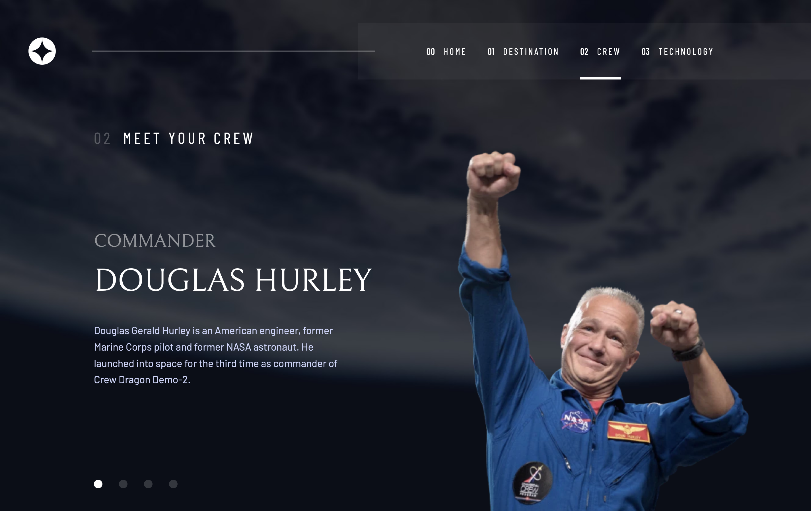
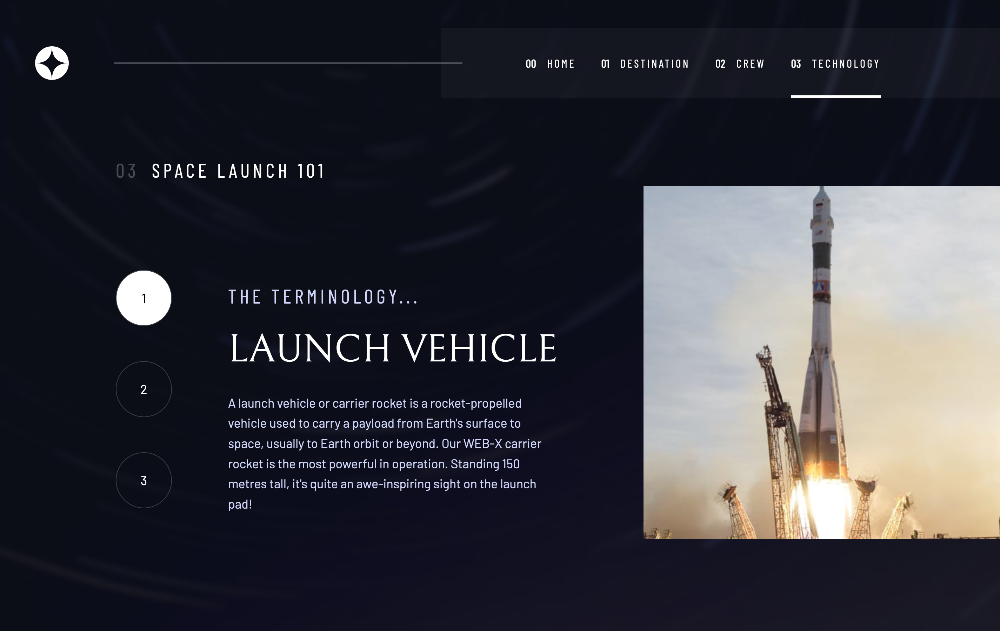

# Frontend Mentor - Space tourism website solution

This is a solution to the [Space tourism website challenge on Frontend Mentor](https://www.frontendmentor.io/challenges/space-tourism-multipage-website-gRWj1URZ3). Frontend Mentor challenges help you improve your coding skills by building realistic projects.

## Table of contents

- [Overview](#overview)
  - [The challenge](#the-challenge)
  - [Screenshot](#screenshot)
  - [Links](#links)
- [My process](#my-process)
  - [Built with](#built-with)
  - [What I learned](#what-i-learned)
  - [Continued development](#continued-development)
  - [Useful resources](#useful-resources)
- [Author](#author)

## Overview

### The challenge

Users should be able to:

- View the optimal layout for each of the website's pages depending on their device's screen size
- See hover states for all interactive elements on the page
- View each page and be able to toggle between the tabs to see new information

### Screenshots

#### Home page

#### Destinations page

#### Crew page

#### Technology page

### Links

- Solution URL: [Add solution URL here](https://your-solution-url.com)
- Live Site URL: [Add live site URL here](https://your-live-site-url.com)

## My process

### Built with

- Semantic HTML5 markup
- CSS custom properties
- Flexbox
- CSS Grid
- Mobile-first workflow
- [React](https://reactjs.org/) - Javascript library
- [Framer-Motion](https://www.framer.com/motion/) - React Motion Library

### What I learned

By building this website I practiced my existing skills in React and React Router and used Framer Motion animation library for the first time.

### Continued development

In the future I'd like to get more practice at using Framer Motion.

### Useful resources

On this [link](https://dev.to/gedalyakrycer/ohsnap-sass-folder-structure-for-react-483e) you can find the folder structure that I used to implement Sass in to this React project.

On this [link](http://getbem.com/) you can learn more about BEM naming convention that I used to name my classes in this project.ewing your solution or for yourself when you look back on this project in the future.\*\*

On this [link](https://www.framer.com/motion/) you can find Framer Motion documentation where you can learn more about this animation library for React.

## Author

- Frontend Mentor - [@andrijaivkovic](https://www.frontendmentor.io/profile/andrijaivkovic)
- Twitter - [@AndrijaIvkovic1](https://twitter.com/AndrijaIvkovic1)
